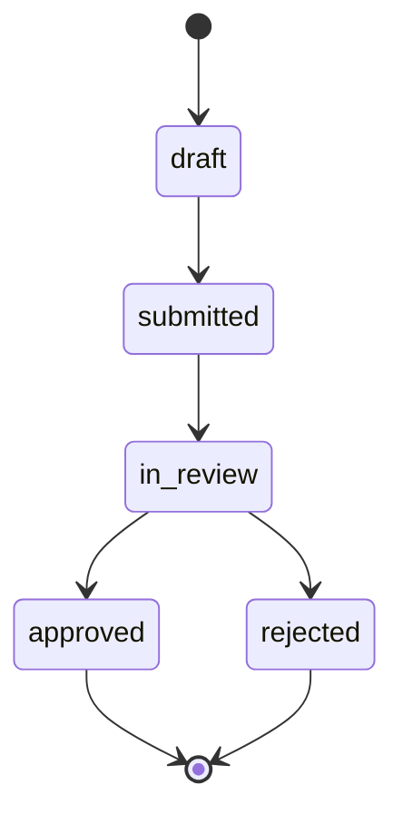
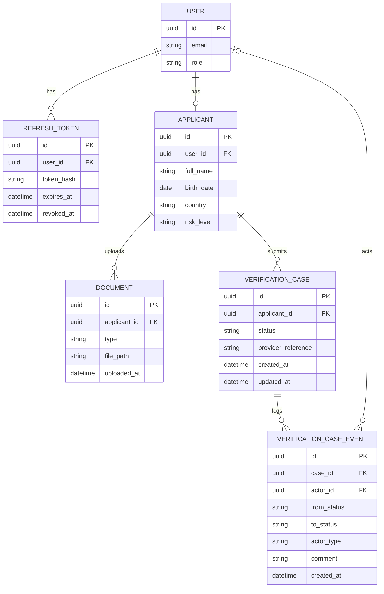

# kyc-verify

kyc-verify is a KYC (Know Your Customer) service that verifies user identity by uploaded documents.

## Table of Contents

- [kyc-verify](#kyc-verify)
  - [Table of Contents](#table-of-contents)
  - [Overview](#overview)
  - [Features](#features)
  - [Tech stack](#tech-stack)
  - [Prerequisites](#prerequisites)
  - [Configuration](#configuration)
    - [Environment Variables](#environment-variables)
  - [Installation \& Setup](#installation--setup)
    - [1. Clone the Repository](#1-clone-the-repository)
    - [2. Copy Environment Configuration](#2-copy-environment-configuration)
    - [3. Build and Start Containers](#3-build-and-start-containers)
  - [Running the Application](#running-the-application)
    - [Starting Services](#starting-services)
    - [Stopping Services](#stopping-services)
    - [Accessing Services](#accessing-services)
    - [Creating a Reviewer](#creating-a-reviewer)
  - [Entity Relationship Diagram](#entity-relationship-diagram)
  - [Testing](#testing)
    - [Running Tests](#running-tests)
  - [Deployment](#deployment)
  - [How to Contribute](#how-to-contribute)
  - [License](#license)

## Overview

An applicant fills in a profile, uploads a passport, a selfie and a proof of address, and submits the case. The case then goes through the statuses below.



## Features

- **Auth** - registration and login with JWT access tokens and refresh tokens.
- **Applicant profile** - validated on the backend, with a simple risk score.
- **Document upload** - passport, selfie and proof of address, sent to the HTTP provider.
- **Async processing** - a generic worker pool on Go channels.
- **State machine** - illegal transitions are rejected.
- **Admin panel** - review queue with risk level and rejection history, approve or reject with a comment.
- **Real-time status** - server-sent events push the new status to the applicant's page.
- **Resilience** - rate limiter and circuit breaker in front of the provider.

## Tech stack

- **Backend**: Go, chi, pgx, golang-migrate, golang-jwt
- **Frontend**: Vue 3 (Composition API), Pinia, Vue Router, Vite
- **Database**: PostgreSQL 16
- **Real-time**: Server-Sent Events
- **DevOps**: Docker, Docker Compose, nginx (production)
- **Tests**: Go `testing`, table-driven

## Prerequisites

Before you begin, ensure you have met the following requirements:

- **Docker** (version 20.10 or higher)
- **Docker Compose** (version 2.24 or higher)
- **Git** (version 2.0 or higher)
- **Go** (version 1.27 or higher)

## Configuration

### Environment Variables

Key environment variables in `.env`:

- `POSTGRES_USER`, `POSTGRES_PASSWORD`, `POSTGRES_DB`, `POSTGRES_PORT`: PostgreSQL credentials and published port
- `DATABASE_URL`: Connection string used by the backend inside the Docker network
- `JWT_SECRET`: Secret used to sign access tokens
- `BACKEND_PORT`, `FRONTEND_PORT`: Published ports of the API and the web application
- `VITE_API_URL`: API address used by the frontend dev server
- `PROVIDER_URL`: HTTP verification provider to use; empty means the built-in mock provider
- `PROVIDER_WEBHOOK_SECRET`: Secret for the HMAC signature of provider callbacks
- `PROVIDER_MIN_DELAY`, `PROVIDER_MAX_DELAY`, `PROVIDER_APPROVE_CHANCE`, `PROVIDER_FAILURE_CHANCE`: Behaviour of the mock provider
- `PROVIDER_RATE_LIMIT_RPS`, `PROVIDER_RATE_LIMIT_BURST`: Rate limiter in front of the provider
- `PROVIDER_CB_FAILURE_THRESHOLD`, `PROVIDER_CB_COOLDOWN`: Circuit breaker in front of the provider

## Installation & Setup

### 1. Clone the Repository

```bash
git clone https://github.com/yognevoy/kyc-verify.git
cd kyc-verify
```

### 2. Copy Environment Configuration

```bash
cp .env.example .env
```

### 3. Build and Start Containers

```bash
docker compose up -d --build
```

Database migrations are applied automatically when the backend starts.

## Running the Application

### Starting Services

```bash
docker compose up -d
```

### Stopping Services

```bash
docker compose down
```

### Accessing Services

- **Web Application**: http://localhost:5173
- **API**: http://localhost:8080 (health check at `/healthz`)
- **PostgreSQL**: localhost:5432

### Creating a Reviewer

To create a reviewer, assign the role in the database:

```bash
docker compose exec postgres psql -U postgres -d kyc_verify \
  -c "UPDATE users SET role='reviewer' WHERE email='you@example.com'"
```

## Entity Relationship Diagram



## Testing

### Running Tests

```bash
cd backend
go test ./... -race
```

## Deployment

A production profile ships alongside the development one.

```bash
cp .env.production.example .env.production

docker compose -f docker-compose.yml -f docker-compose.prod.yml --env-file .env.production up -d --build
```

## How to Contribute

If you find a bug or have a feature request, please check the [Issues page](https://github.com/yognevoy/kyc-verify/issues) before creating a new one. For code contributions, fork the repository, make your changes on a new branch, and submit a pull request with a clear description of the changes. Please make sure to test your changes thoroughly before submitting.

## License

This project is licensed under the MIT License - see the [LICENSE.txt](https://github.com/yognevoy/kyc-verify/blob/main/LICENSE.txt) file for details.
